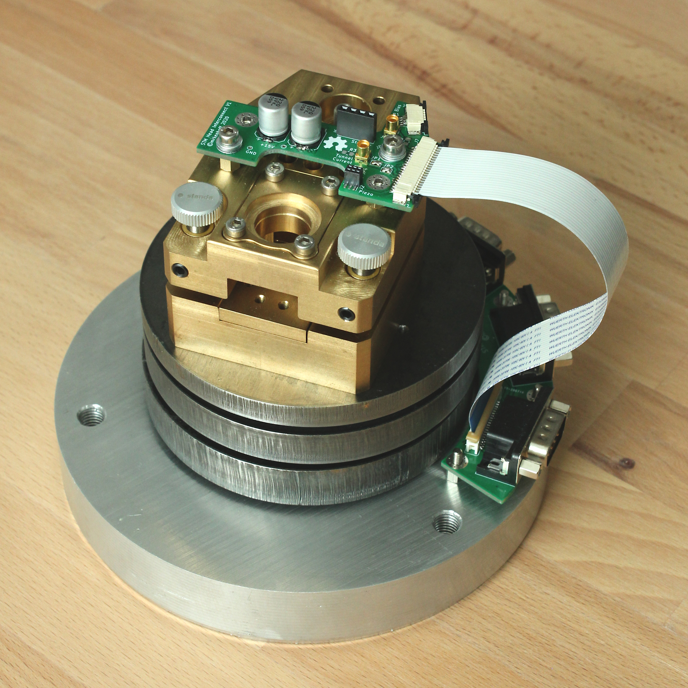
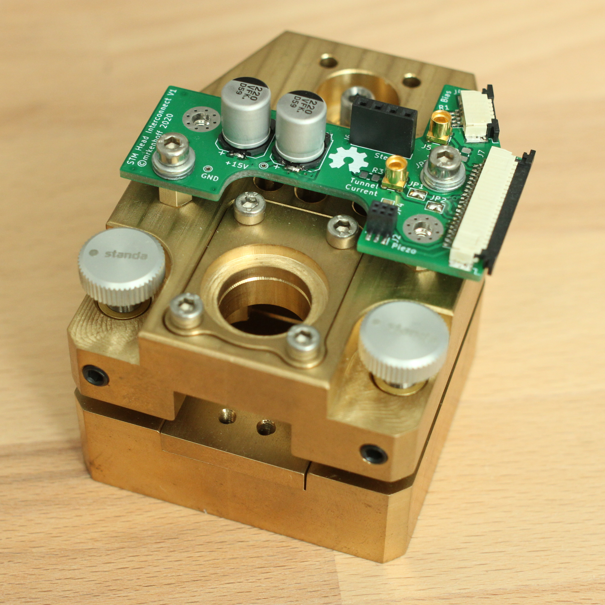
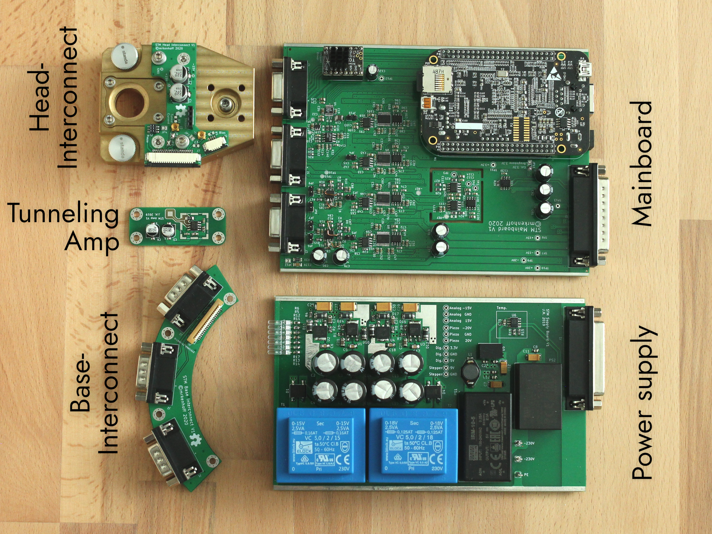
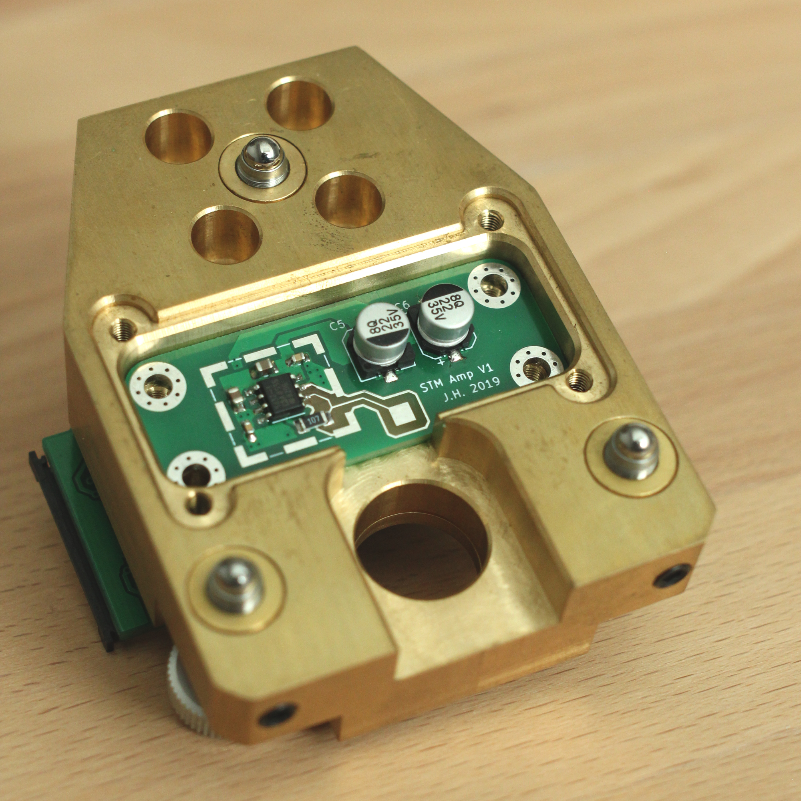

# Scanning tunneling microscope

# Table of Contents
- [Mechanics](#mechanics)
  - [Vibration Isolation](#vibration-isolation)
  - [Piezo Scanner](#piezo-scanner)
  - [Scan Head Assembly](#scan-head-assembly)
- [Electronics](#electronics)
- [References](#references)

# Mechanics

### Vibration Isolation

Mechanical vibrations present a major difficulty in scanning probe microscopy, as they can interfere with the very small (resolutions of a few 0.1 nm are not uncommon [1]) scanning movements of the tip, leading to a distorted image. Even worse, large mechanical vibrations can cause the scanning tip, which is usually positioned only a few Angstrom above the sample surface [2], to crash into the sample.

Unfortunately, there are many sources for mechanical vibrations: Driving cars, peoples walking around, wind blowing on the walls of your house and the subtle, but omnipresent seismic activity of the earth, just to name a few.
Especially since I'm living in a big City, good isolation of vibrations from the scanning head was essential for this build.
To accomplish this, I used a stack of steel plates, separated using pieces of Viton o-rings. 
Viton was used, as it is reported to have a high damping coefficient, making it particularly usefull for vibration isolation [3]. This tower of heavy masses and Viton "springs/dampers" can be described as a set of coupled harmonic oscillators, which (if tuned correctly) provide an efficient way of decoupling mechanical vibrations. The vibration isolation should be designed to have the smallest possible resonance frequency (usually in the range of a couple Hz [*todo: citation*]), resulting in the desired attenuation of vibrations in the higher frequency range. The scanning head itself, which is mounted on the topmost steel plate, is designed to have the largest possible resonance frequency. This will guarantee, that any low frequency component that couple through the vibration isolation assembly will only shake the scanning head as a whole, and not influence the relative position between the tip and the probe surface.

The figure above depicts an aluminium baseplate (150 mm diameter, 25 mm thickness), the stack of steel plates and viton o-rings, and the scanning head. The steel plates have a diameter of 100 mm and have an decreasing thickness of 15 mm, 12 mm and 8 mm towards the top. I do have some spare plates lying around, so I will definately try out some other configurations as well. The plates are lasercut - hence the terrible surface finish. I might clean them up on a lathe if I can get my hands on one at some point...
The complete depicted assembly can optionally be hung from some kind of support structure using steel springs or elastic rope to add another stage of vibration isolation. Since the baseplate is made of aluminium, additional eddy-current damping can be applied if needed.

### Piezo Scanner
Most professional scanning tunneling microscopes make use of piezo tube scanners. Due to their high rigidity (high resonance frequency) and exceptional linearity they are ideally suited for that task. Unfortunately they can cost up to several hundred euros and it's not easy to find a distributor who sells these things to individuals in the first place.

Fortunately, there is an alternative for the expensive piezo tube scanners: Flat piezo disks, commonly used as acoustic transducers in all kinds of electronic devices, can be modified to provide the desired x/y/z scanning motion. For that, the top electrode of the piezo must be cut into four segments, which will be individually controlled using four control voltages. A small standoff is glued to the bottom side of the piezo disk, to which the scanning probe tip is attached.
Depending on the applied voltages, the piezo disk will bend and warp, resulting in a translation of the scanning probe tip.
The idea and the first successfull realization for this "unimorph disk scanner" have been published by John Alexander in his great STM Project.
Since then, this approach has been successfully used in numerous other low-cost STM projects, as these devices are really cheap (less than 1€ per part) and sold by all major electronics distributors.
The downside of this approach is its low mechanical rigidity, resulting in a lower resonance frequency compared to professional piezo tube scanners. Therefore the achievable scan speed is somewhat limited and the piezo scanner assembly is more sensitive to mechanical vibrations. 
These are limitations I am willing to accept, as it saves me a lot of money, while still providing great results.

I used a 20 mm piezo disk and carefully cut the upper electrode into four segments using a scalpel. 

### Scan Head Assembly

The scan head assembly is the central piece of the STM. It's the place where the piezo scanner, including the scanning probe tip, and the material to be imaged are mounted and brought together, and thus contributes directly the achievable image quality. 

All parts of the scan head assembly have been machined out of brass using a CNC mill. The choice of material is 

- Lowest possible thermal expansion coefficient to reduce gradient artifacts due to thermal fluctuations.
- Highest possible stiffness in order to achieve a high mechanical resonance frequency of the scan head assembly.
- The material must not cost a fortune and should be relatively easy to machine without highly specializied equipment.

# Electronics

### Tunneling Amp

# References

- [1] C. Bai (2000). Scanning tunneling microscopy and its applications. New York: Springer Verlag. ISBN 978-3-540-65715-6.
- [2] C. Julian Chen (1993). Introduction to Scanning Tunneling Microscopy (PDF). Oxford University Press. ISBN 978-0-19-507150-4.
- [3] Oliva, Ai & Aguilar, Marilyn & Sosa, Victor. (1999). Low- and high-frequency vibration isolation for scanning probe microscopy. Measurement Science and Technology. 9. 383. 10.1088/0957-0233/9/3/011.

